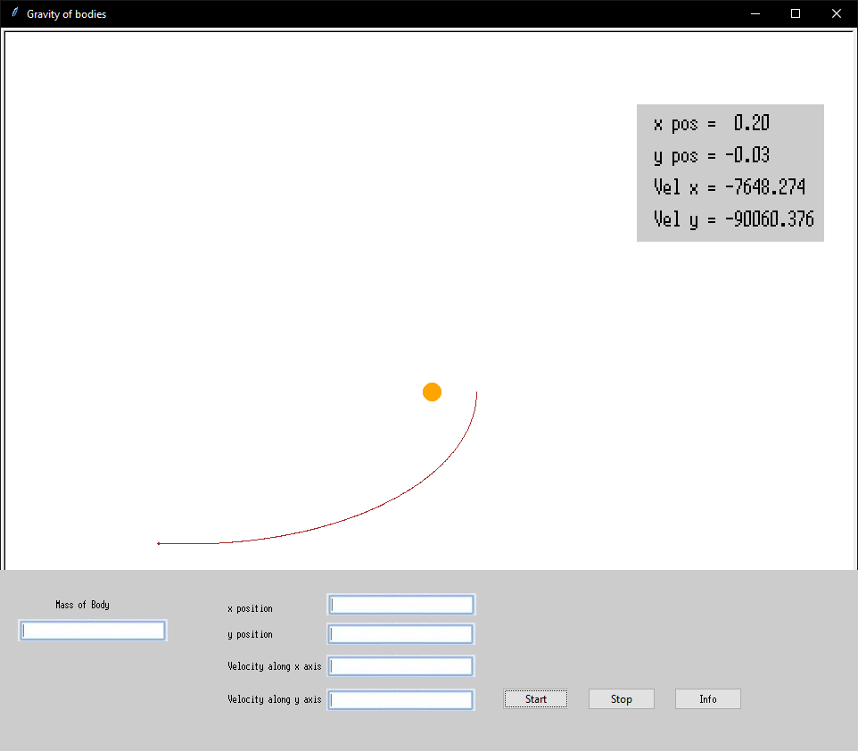

# Проєкт: Рух космічних тіл

- [Проєкт: Рух космічних тіл](#проєкт-рух-космічних-тіл)
  - [Мета проекту](#мета-проекту)
  - [Педагогічна мета проекту](#педагогічна-мета-проекту)
  - [Інтерфейс проекту](#інтерфейс-проекту)
  - [MVP](#mvp)
  - [Послідовність реалізації проекту](#послідовність-реалізації-проекту)
  - [Технолоії для реалізації](#технолоії-для-реалізації)

## Мета проекту

Розробити інтерактивну комп'ютерну модель, яка дозволить вивчати основи фізики через симуляцію руху тіл під впливом гравітації Сонця. Модель повинна надавати можливість спостерігати та експериментувати з різними параметрами тіл, такими як маса, початкова швидкість, та визначати їх вплив на траєкторії руху.

## Педагогічна мета проекту

1. Діти можуть бачити результати свого коду в реальному часі, спостерігаючи за анімацією та рухом тіл на екрані. Це допомагає їм зв'язати написаний код із зовнішнім візуальним виглядом.
2. Проект також надає можливість дітям краще розуміти фізичні закони, такі як гравітація, та їх вплив на рух тіл. Це розширює їхні знання про природу.

## Інтерфейс проекту

1. Головне поле:

   - Відображення планетарного руху: У головному полі відображена планета, яка рухається вздовж своєї орбіти. Вона може мати власну текстуру та візуалізацію.

2. Поле керування:

   - У нижній (або боковій) частині вікна є поле для керування:

     - Поля для введення параметрів тіл: дозволяють користувачеві змінювати масу, початкову швидкість та відстань тіла до Сонця.
     - Кнопка "Старт/Стоп": Додає кнопку для запуску або зупинки симуляції. Користувач може паузити чи відновити рух планети.
     - Кнопка "Інформація": Дозволяє користувачеві переглядати інформацію про параметри об'єкта.

## MVP

Задавати параметри можна в серединні програми без використання поля керування. Відображення руху тіла відбувається у вінкі.

## Послідовність реалізації проекту

1. Реалізувати поля для введення параметрів.
2. Реалізувати кнопки "Старт/Стоп".
3. Реалізувати кнопку "Інформація", яка буде викликати інформаційне вікно, що відображає поточне положення та швидкість тіла.

## Технолоії для реалізації

1. Пакет [turtle](https://docs.python.org/uk/3/library/turtle.html)
2. Пакет [tkinter](https://docs.python.org/uk/3/library/tkinter.html)
