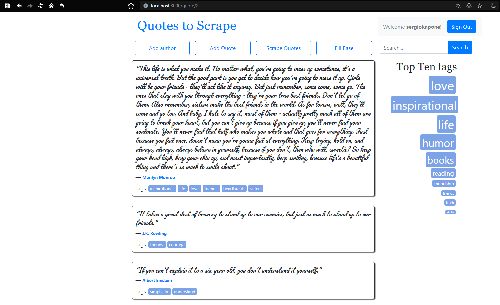

# Проєкт: Онлайн Цитатник для підлітків

- [Проєкт: Онлайн Цитатник для підлітків](#проєкт-онлайн-цитатник-для-підлітків)
  - [Мета проекту](#мета-проекту)
  - [Структура пректу](#структура-пректу)
  - [Інтерфейс проекту](#інтерфейс-проекту)
  - [Функціонал](#функціонал)
  - [MVP](#mvp)
  - [Послідовність реалізації проекту](#послідовність-реалізації-проекту)
  - [Технолоії для реалізації](#технолоії-для-реалізації)
  
## Мета проекту

Підлітки часто шукають надихаючі та мотивуючі цитати, але їм може бракувати зручного та інтерактивного способу зберігати й обмінюватися ними.
Створення онлайн-цитатника, який дає змогу підліткам зберігати свої улюблені цитати, обмінюватися ними з друзями та знаходити нові й надихаючі висловлювання.

## Структура пректу

1. Головна сторінка
2. Особистий цитатник користувача
3. Сторінка обміну цитатами
4. Профіль користувача
5. Пошук цитат за категоріями
6. Особисті налаштування

## Інтерфейс проекту

Інтерфейс подібний до такого, що роеалізований в [проекті](https://github.com/sergiokapone/goit_python_web_hw10).

## Функціонал

1. Додавання і редагування цитат в особистому цитатнику.
2. Обмін цитатами з друзями.
3. Пошук цитат за категоріями (мудрість, мотивація, гумор тощо).

## MVP

1. Реєстрація та створення особистого профілю.
2. Додавання і редагування цитат в особистому цитатнику.

## Послідовність реалізації проекту

1. Створення функціоналу по обміну цитатами з іншими користувачами.
2. Створення опції пошуку цитат.
   - за категоріями;
   - за змістом.

## Технолоії для реалізації

1. [Django](https://www.djangoproject.com/) / [FastAPI](https://fastapi.tiangolo.com/) для бекенда.
2. [Flask](https://flask.palletsprojects.com/en/3.0.x/) / [Streamlit](https://streamlit.io/) / [REMI](https://github.com/rawpython/remi) для фронтенда.
3. Бази даних для зберігання цитат і профілів користувачів (`SQLite / Postgres`).
